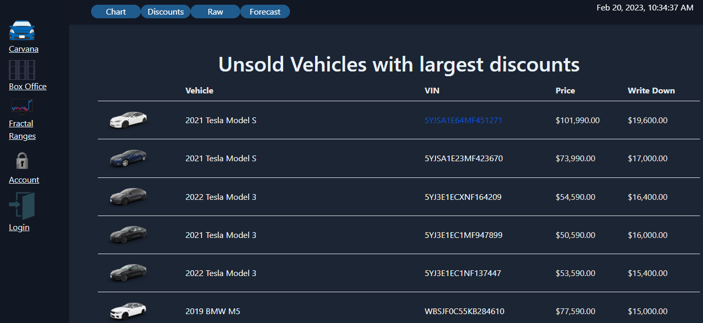
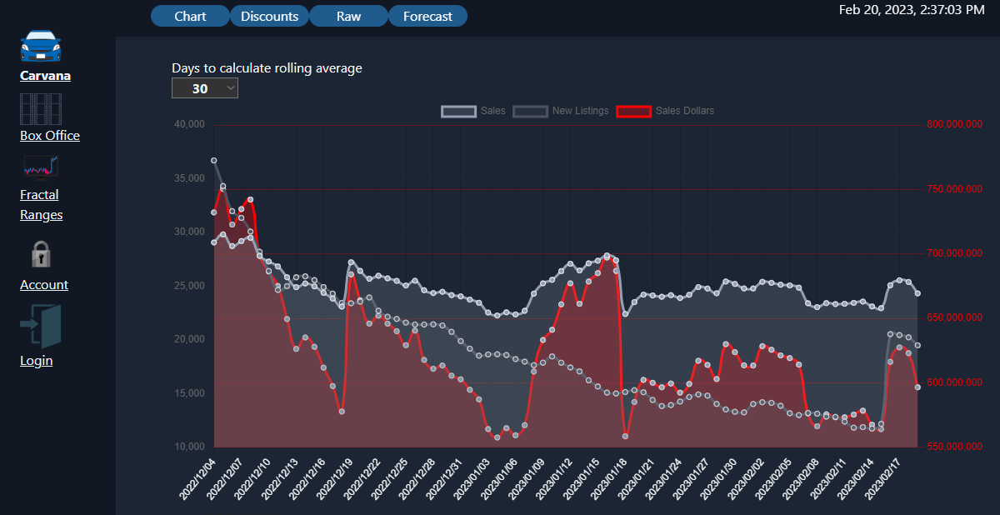
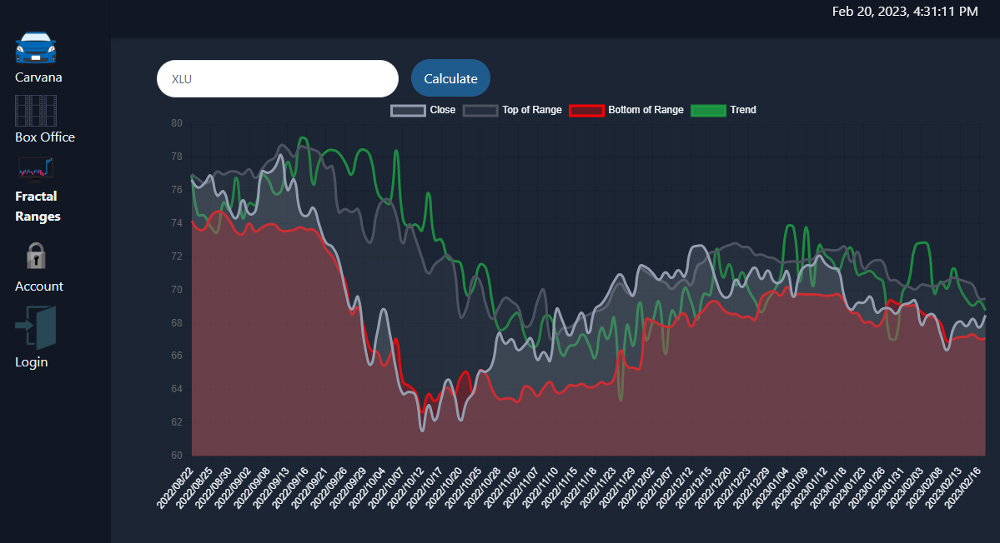
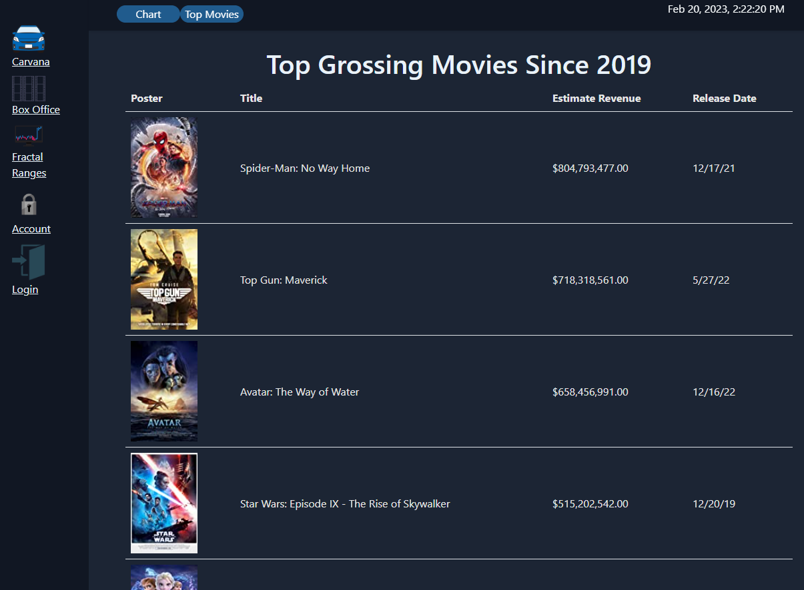
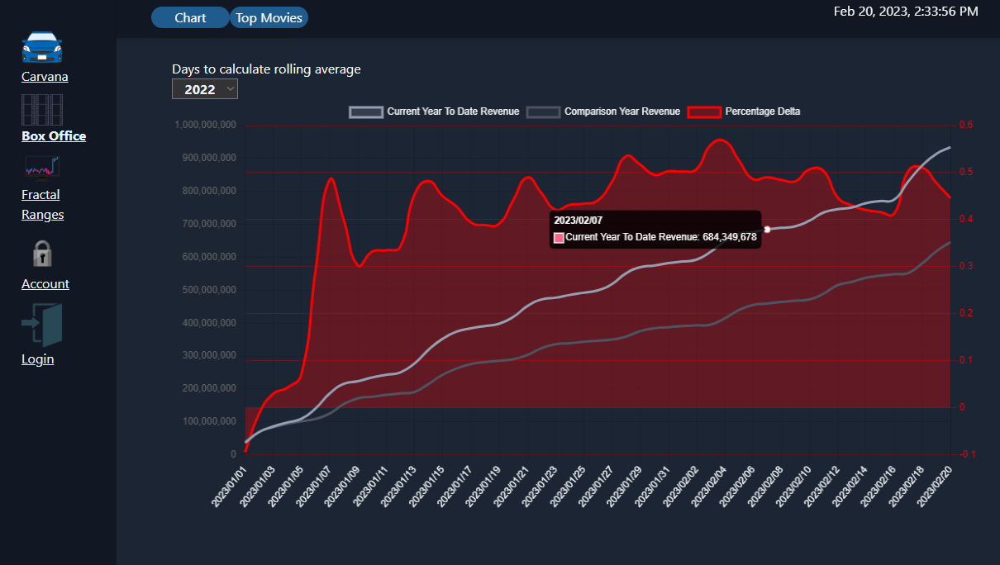
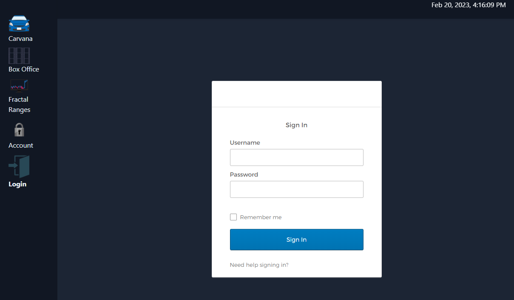

# multi-project-frontend

Angular Frontend for a compilation of Spring projects.

# Frontend features
<li>Uses Eureka Naming Server as an API gateway.</li>
<li>LocalStorage keeps track of Angular routes in case of application refresh.</li>
<li>Uses Okta as authentication server</li>
<li>Authentication interceptor service for protected routes that require Okta Auth Token</li>
<li>Charts for data built with ng2-charts package and Chart.js</li>
<li>Node configured for SSL authentication. </li>
<li>Stores and retrieves user settings from user management server. <a href="https://github.com/Ulatec/user-manager">user-manager</a></li>

# Components

## Carvana Tracker

 
Repo: <a href="https://github.com/Ulatec/CarvanaTracker">https://github.com/Ulatec/CarvanaTracker</a>

## Fractal Range Generator

 
Repo: <a href="https://github.com/Ulatec/fractal-range-generator">https://github.com/Ulatec/fractal-range-generator</a>

## Box Office Tracker

 
Repo: <a href="https://github.com/Ulatec/BoxOfficeTracker">https://github.com/Ulatec/BoxOfficeTracker</a>

## Other
